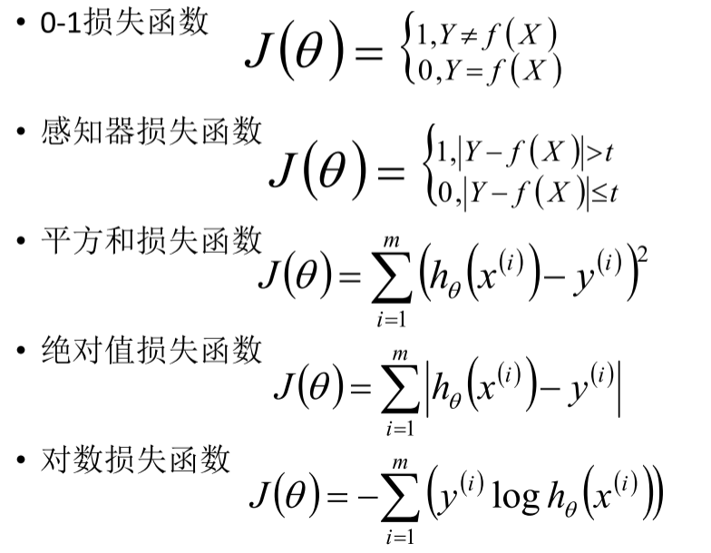
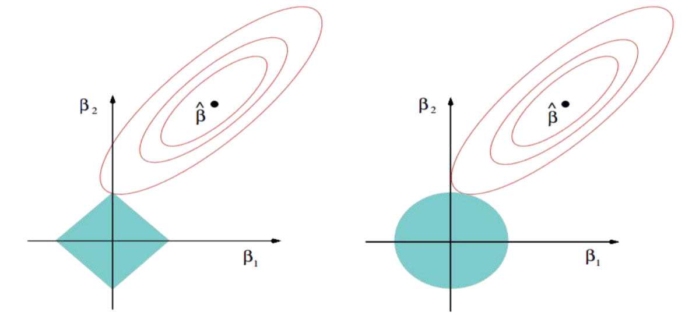

# 线性回归

[TOC]

点击链接即可查看(Ctrl):
[机器学习-线性回归-全面梳理线性回归](https://zhuanlan.zhihu.com/p/139445419)
[机器学习-线性回归-模型原理-公式推导-代码实现](https://zhuanlan.zhihu.com/p/80887841)
[机器学习-线性回归-最小二乘法和损失函数](https://zhuanlan.zhihu.com/p/141201873)
[机器学习-线性回归-值得一看](https://zhuanlan.zhihu.com/p/53979679)

## 什么是回归算法
***

* 回归算法是一种有监督算法

* 建立“解释”变量(自变量X)和观测值(因变量Y)之间的关系

* 从机器学习的角度来讲，用于构建一个算法模型(函数)来做属性(X)与标签(Y)之间的映射关系，在算法的学习过程中，试图寻找一个函数h: R^d->R，使得参数之间的关系拟合性最好。

* 回归算法中算法(函数)的最终结果是一个连续的数据值，输入值(属性值)是一个d维度的属性/数值向量

  

## 线性回归
***

> 作用:   连续值的预测 
>
> 最优模型: 最优模型也就是所有样本(训练数据)离模型的直线或者平面距离最小
>
> 线性关系: 特征属性X和目标属性Y之间的关系是满足线性关系
$$
\begin{equation}\begin{aligned}
h_\theta(x) & =\theta_0+\theta_1 x_1+\cdots+\theta_n x_n \\& =\theta_0 1+\theta_1 x_1+\cdots+\theta_n x_n \\& =\theta_0 x_0+\theta_1 x_1+\cdots+\theta_n x_n \\& =\sum_{i=0}^n \theta_i x_i=\theta^T x
\end{aligned}\end{equation}
$$

* 目标属性h(x)，x代表特征值，x前面的代表参数，θ要求解的。求出后就可以确定h(x)

* θ(T):  (1, n), x: (n, 1),  等号右边是一个标量

* 机器学习中通常采用列向量为基本向量，所以需要要把θ转置为行向量  

  

## 最小二乘法
***

> 计算预测值和实际值的差值的平方然后求出这个值的最小值对应的参数, 就是我们要的模型

$$
\begin{align}   
J(\theta)=\frac{1}{2} \sum_{i=1}^m\left(\varepsilon^{(i)}\right)^2=\frac{1}{2} \sum_{i=1}^m\left(h_\theta\left(x^{(i)}\right)-y^{(i)}\right)^2  & \quad\text{}
\end{align}
$$

* 差值有正有反，会互相抵消，用平方来避免。ε代表差值。其中1/2是为了后面方便求导，不会对所求产生影响

* 求出这个差值函数的最小值时的参数值得到模型

* 房价预测

  > 二元二次函数， 凸函数， 求极小值得出结果。n元n次超平面
  
  

## 最大似然估计
***
> 解释最大似然估计(maximum likelihood estimation，MLE)：估计参数的方式，投掷硬币，独立事件，同时发生的概率， 即每个事件发生概率相乘，就是联合概率，联合概率越大越好，关于参数p的似然函数，极大化，取对数，求最大值

### 正态分布
* 理想误差$\varepsilon^{(\mathrm{i})}(1 \leq i \leq n)$，独立同分布的，服从均值为0，方差为某$\theta^2$定值的高斯分布
* 随机现象可以看做众多因素的独立影响的综合反应，往往服从正态分布，误差出现的概率：
$$
\begin{align}   f(x)=\frac{1}{\sqrt{2 \pi} \sigma} \exp \left(-\frac{(x-\mu)^2}{2 \sigma^2}\right)  & \quad\text{}\end{align}
$$
* 原因：中心极限定理，解释了为什么服从正态分布

  
  

### 似然函数

$$
\begin{align}   y^{(i)}=\theta^T x^{(i)}+\varepsilon^{(i)}  & \quad\text{第i组数据下的关系} \end{align}
$$
$$
\begin{align}   p\left(\varepsilon^{(i)}\right)=\frac{1}{\sigma \sqrt{2 \pi}} e^{\left(-\frac{\left(\varepsilon^{(i)}\right)^2}{2 \sigma^2}\right)}  & \quad\quad\text{误差符合正态分布-概率越大越靠近均值-预测就越准确} \\  \end{align}
$$
$$
\begin{align}   xp\left(y^{(i)} \mid x^{(i)} ; \theta\right)=\frac{1}{\sigma \sqrt{2 \pi}} \exp \left(-\frac{\left(y^{(i)}-\theta^T x^{(i)}\right)^2}{2 \sigma^2}\right)  & \quad\quad\text{结合（4）与（5）得到}\end{align}
$$
> 此式表示，在$\theta$和$x^{（i）}$下，$y^{（i）}$符合程度，即概率

$$
\begin{align}   \begin{aligned}
L(\theta) & =\prod_{i=1}^m p\left(y^{(i)} \mid x^{(i)} ; \theta\right) \\
& =\prod_{i=1}^m \frac{1}{\sigma \sqrt{2 \pi}} \exp \left(-\frac{\left(y^{(i)}-\theta^T x^{(i)}\right)^2}{2 \sigma^2}\right)
\end{aligned}  & \quad\quad\text{$\theta$下的似然估计-联合概率-似然函数}\\  \end{align}
$$
> $\ln L(\theta)$要极大化似然函数，值越大说明越符合模型，即可得到$\theta$

***

#### 似然函数取对数
> 目的: （4）式需要处理才可方便计算，一般都是取对数，结果如下：

$$
\begin{align}   \begin{array}{l} 
\ell(\theta)=\ln L(\theta) \\
=\ln \prod_{i=1}^m \frac{1}{\sigma \sqrt{2 \pi}} \exp \left(-\frac{\left(y^{(i)}-\theta^T x^{(i)}\right)^2}{2 \sigma^2}\right) \\
=\sum_{i=1}^m \ln \frac{1}{\sigma \sqrt{2 \pi}} \exp \left(-\frac{\left(y^{(i)}-\theta^T x^{(i)}\right)^2}{2 \sigma^2}\right) \\
=m \ln \frac{1}{\sigma \sqrt{2 \pi}}-\frac{1}{\sigma^2} \bullet \frac{1}{2} \sum_{i=1}^m\left(y^{(i)}-\theta^T x^{(i)}\right)^2 \\
\operatorname{loss}\left(y_j, \hat{y}_j\right)=J(\theta)=\frac{1}{2} \sum_{i=1}^m\left(h_\theta\left(x^{(i)}\right)-y^{(i)}\right)^2
\end{array}  & \quad\text{和最小二乘法式（2）做对比--结果一致}\end{align}
$$
>[点击跳转到最小二乘法](#最小二乘法)

* 得到$J(\theta)$目标函数，极大化似然函数转化求$J(\theta)$的最小值， 如下

  

## $\theta$的求解过程

***
$$
\begin{align}   J(\theta)=\frac{1}{2} \sum_{i=1}^m\left(h_\theta\left(x^{(i)}\right)-y^{(i)}\right)^2  & \quad\text{目标函数-待处理函数} \end{align}
$$

$$
\begin{align}   \begin{array}{l} 
J(\theta)= \frac{1}{2} \sum_{i=1}^m\left(h_\theta\left(x^{(i)}\right)-y^{(i)}\right)^2=\frac{1}{2}(X \theta-Y)^T(X \theta-Y) \rightarrow \min _\theta J(\theta) \\
\nabla_\theta J(\theta)=\nabla_\theta\left(\frac{1}{2}(X \theta-Y)^T(X \theta-Y)\right)=\nabla_\theta\left(\frac{1}{2}\left(\theta^T X^T-Y^T\right)(X \theta-Y)\right) \\
=\nabla_\theta\left(\frac{1}{2}\left(\theta^T X^T X \theta-\theta^T X^T Y-Y^T X \theta+Y^T Y\right)\right) \\
=\frac{1}{2}\left(2 X^T X \theta-X^T Y-\left(Y^T X\right)^T\right) \\
=X^T X \theta-X^T Y \\
\theta=\left(X^T X\right)^{-1} X^T Y
\end{array}  & \quad\text{求偏导-矩阵对向量}\end{align}
$$
>对$J(\theta)$求偏导，就是求梯度，梯度意味着是对$\theta$内每一个参数求导了，求导公式如下：
>
>> $$
>> \begin{array}{c}
>> \frac{\partial A \cdot x}{\partial x}=A^T \quad \frac{\partial x \cdot A}{\partial x}=A \\
>> \frac{\partial A \cdot x}{\partial x^T}=A \quad \frac{\partial x \cdot A}{\partial x}=A^T \\
>> \frac{\partial \mathbf{x}^{\mathbf{T}} \mathbf{x}}{\partial \mathbf{x}}=2 \mathbf{x} \\
>> \frac{\partial \mathbf{x}^{\mathbf{T}} \mathbf{A} \mathbf{x}}{\partial \mathbf{x}}=\left(\mathbf{A}+\mathbf{A}^{\mathbf{T}}\right) \mathbf{x}
>> \end{array}
>> $$

> 推导如下等式：
> $$
> \frac{1}{2} \sum_{i=1}^m\left(h_\theta\left(x^{(i)}\right)-y^{(i)}\right)^2=\frac{1}{2}(X \theta-Y)^T(X \theta-Y)
> $$
> 
>
> 1. 由(4)和(9)得:
>    $$
>    \begin{align}   J(\theta)=\frac{1}{2} \sum_{i=1}^m\left(\varepsilon^{(i)}\right)^2\end{align}
>    $$
>    
>
>    > 变换成矩阵形式：
>    > $$
>    > \begin{equation}\begin{aligned}   
>    > \begin{pmatrix} \varepsilon^{(1)} \\ \varepsilon^{(2)} \\ \cdots \\ \varepsilon^{(n)} \end{pmatrix} \begin{pmatrix} \varepsilon^{(1)} & \varepsilon^{(2)} & \cdots & \varepsilon^{(n)} \end{pmatrix}  & \end{aligned}\end{equation}
>    > $$
>    > 
>
> 2. $$
>    \begin{align} \frac{1}{2}(X \theta-Y)^T(X \theta-Y)  \rightarrow (X \theta-Y)^T  \end{align}
>    $$
>
>    > $X$（m*n）表示m个数据，n个特征
>>
> > $Y$（m*1）表示m个数据预测的结果
> >
> > $\theta$  （n*1）表示特征参数
> >
> > 因此$X \theta-Y$为（m*1），观察比较(14)可得等式

## 最小二乘法$\theta$参数最优解

***
> 作用：最小二乘法的使用要求矩阵是可逆的；为了防止不可逆或者过拟合的问题存在，可以增加额外数据影响，导致最终的矩阵是可逆的
>
> 作用原理？

* 表达式：
  $$
  \begin{align}\theta=\left(X^TX+\lambda I\right)^{-1}X^Ty & \quad\text{} \end{align}
  $$
  

## 多项式扩展

***
> 产生：基于现有数据构造出新的数据
>
> 目的：解决欠拟合问题， 不易一定能解决；多一点特征向量，模型越复杂；模型越复杂，就可能使结果更准确；扩展越多， 过拟合， 模型复杂， 利用交叉验证来减少

* $ \begin{pmatrix} x^{(1)} & x^{(2)} & x^{(3)} \end{pmatrix} \rightarrow \begin{pmatrix} x^{(1)} & x^{(2)} & x^{(3)} &  x^{(1)}x^{(2)} & x^{(2)}x^{(3)} & x^{(3)}x^{(1)} \end{pmatrix}$

  > 扩展原则：三项以上的交互项不可出现元素重复
  
  

## 线性回归的过拟合

***

> 预测结果由参数$\theta$决定， 可能出现过大与过小的情况， 主要是因为太大了
>
> 过拟合：训练集上的效果好，在测试集评估效果不好--模型过于复杂，数据冗余特征多--无效特征多--数据量少，把背景学习进去了，影响有用的特征
>
> >解决：增加数据集和去除冗余特征，加入惩罚项（正则项）
>
> 欠拟合：训练的评估指标不好--模型过于简单--数据量不够与特征不够好，特征不够好：不是有效的特征和特征数据不好--没有处理相关特征
>
> > 解决：从处理特征层面，增加模型复杂度，不是扩展的阶数越多越好，容易导致过拟合，多项式扩展

* 正则项(norm)/惩罚项

  > 目的：为了防止数据过拟合，也就是的θ值在样本空间中不能过大，可以在目标函数之上增加一个平方和损失
  >
  > > 损失函数：
  > >
  > > 
  > >
  > > 对数损失和0-1用于分类，其余用于回归问题
  >
  > 惩罚项：
  > $$
  > \lambda\sum_{j=1}^n\theta_j^2
  > $$
  > 加入惩罚项表达式：
  > $$
  > \begin{align}   J\big(\theta\big)=\frac{1}{2}\sum_{i=1}^n\Big(h_\theta\big(x^{(i)}\big)-y^{(i)}\Big)^2+\lambda\sum_{i=1}^n\theta_j^2 & \quad\text{LASSO(L1-norm)}\end{align}
  > $$
  > 对于惩罚项的理解：
  >
  > > 为了防止过拟合问题，就转化成了，有约束条件的函数优化转化成无约束体条件的优化问题
  > >
  > > 
  > >
  > > 注释：左：Ridge(L2-norm)  右：LASSO(L1-norm)
  > >
  > > 如右图所示为半径为t的圆，圆内是约束条件（惩罚项）下的特征值，圆越小代表约束越大；右上方是红圈表示初始目标函数的等高线，由抛物面投影到平面得到，越靠近圆心表示预测值越接近真实值；等值线越小越好，但惩罚项的作用也限定了范围，所以在像相切除为最优化处；相切除为最优化处，目标函数的梯度和约束条件梯度相反，大小不同，不同量纲的两个数，配平梯度长度，所以要加入$\lambda$，使得两者大小相同
  > >
  > > ***
  > >
  > > 
  > >
  > > * Ridge(L2-norm)和LASSO(L1-norm)比较
  > >
  > >   > LASSO：Least Absolute Shrinkage andSelection Operator
  > >   >
  > >   > Ridge(L2-norm): $J\bigl(\theta\bigr)=\frac{1}{2}\sum\limits_{i=1}^n\bigl(b_\theta\bigl(x^{(i)}\bigr)-y^{(i)}\bigr)^2+\lambda\sum\limits_{j=1}^n\Bigl|\theta_j\Bigr|\quad\lambda>0$
  > >   >
  > >   > Ridge(L2-norm)(岭回归)：具有较高的求解速度；不可能导致有维度参数变为0的情况，那么也就不会产生稀疏解；数据的维度中是存在噪音和冗余的
  > >   >
  > >   > LASSO(L1-norm)：Ridge模型具有较高的准确性、鲁棒性以及稳定性(冗余特征已经被删除了)；稀疏的解可以找到有用的维度并且减少冗余，提高后续算法预测的准确性和鲁棒性
  > >
  > >   * 如果既要考虑稳定性也考虑求解的速度，就使用Elasitc Net
  > >   
  > >     > $$
  > >     > \begin{gathered}
  > >     > I\big(\theta\big)=\frac{1}{2}\sum_{i=1}^{m}\big(h_{\theta}\big(x^{(i)}\big)-y^{(i)}\big)^{2}+\lambda\Big(p\sum_{j=1}^{n}\big|\theta_{j}\big|+\big(1-p\big)\sum_{j=1}^{n}\theta_{j}^{2}\Big) \\
  > >     > \left\{\begin{array}{l}\lambda>0\\ p\in[0,1]\end{array}\right. 
  > >     > \end{gathered}
  > >     > $$
  > >     >

## 模型效果判断

***

  

  

## 机器学习调参

***

> 算法模型(线性回归)来讲，我们需要获取θ、λ、p的值；θ的求解其实就是算法模型的求解，一般不需要开发人员参与(算法已经实现)，主要需要求解的是λ和p的值，这个过程就叫做调参(超参)
>
> 目的：找到一组超参数（均值）

* 交叉验证：将训练数据分为多份，其中一份进行数据验证并获取最优的超参：λ和p训练（返回训练）-验证8000（分5等分）-测试（最后）

* 多则交叉验证可以获得多组，更稳定，进行求均值，比如：十折交叉验证、五折交叉验证(scikit-learn中默认)等；

  > 多则交叉成本会增加

[跳到开头(Ctrl)](#线性回归)

# 梯度下降法

***

> 作用：梯度下降法(Gradient Descent，GD)常用于求解无约束情况下凸函数(Convex Function)的极小值，是一种迭代类型的算法，因为凸函数只有一个极值点，故求解出来的极小值点就是函数的最小值点

* 待处理问题：
  $$
  \begin{align}   
  \begin{aligned}
  &J\bigl(\theta\bigr)=\frac{1}{2m}\sum_{i=1}^{m}\bigl(h_{\theta}\bigl(x^{(i)}\bigr)-y^{(i)}\bigr)^{2} \\
  &\theta^*=\arg\min J\big(\theta\big)
  \end{aligned}  & \quad\text{问题：求解目标函数最小值下的}\theta\end{align}
  $$

  > 根据实际问题目标函数转化求解如下目标函数：
  > $$
  > 
  > $$
